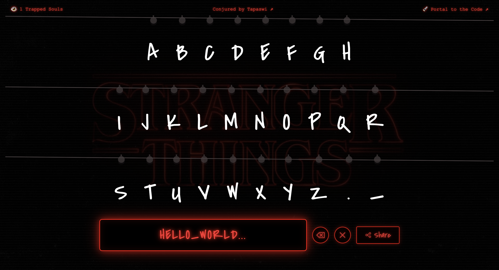

# 💡 Stranger Lights

<div align="center">


**An interactive Stranger Things-inspired alphabet wall that brings messages to life with glowing bulbs**

[](https://nextjs.org/)
[](https://reactjs.org/)
[](https://www.typescriptlang.org/)
[](https://www.framer.com/motion/)

[✨ View Demo](https://www.linkedin.com/posts/tapaswi-v-s_upsidedown-strangerthings-strangerthings-activity-7402500202538020864-k_2I?utm_source=share&utm_medium=member_desktop&rcm=ACoAABoXfvsBmyiQpzKa8stRlfBbdKiaEQ9HWEo) • [🐛 Report Bug](../../issues) • [💡 Request Feature](../../issues)

</div>

---

## 📸 Preview

<div align="center">
  
</div>

---

## 🌟 About

Remember that iconic scene from Stranger Things where Will Byers communicates through Christmas lights? Now you can create your own messages with this interactive alphabet wall! Click on letters to light them up, spell out messages, and share them with friends.

### ✨ Features

- 🔤 **Interactive Alphabet Wall** - Click on any letter to toggle its light
- ⚡ **Real-time Updates** - Watch the lights flicker to life with smooth animations
- 🎵 **Sound Effects** - Authentic clicking sounds for an immersive experience
- 🔗 **Shareable Messages** - Generate unique URLs to share your illuminated messages
- 📱 **Responsive Design** - Works seamlessly on desktop and mobile devices
- 🎨 **Authentic Styling** - Flickering red lights with a vintage aesthetic
- 🌙 **Dark Theme** - Immersive dark background with textured wall

## 🚀 Getting Started

### Prerequisites

- Node.js 18.x or higher
- npm or yarn

### Installation

1. **Clone the repository**

```bash
git clone https://github.com/tapaswi-v-s/stranger-lights.git
cd stranger-lights
```

2. **Install dependencies**

```bash
npm install
# or
yarn install
```

3. **Run the development server**

```bash
npm run dev
# or
yarn dev
```

4. **Open your browser**

Navigate to [http://localhost:3000](http://localhost:3000) to see the app in action!

## 🎮 Usage

1. **Light Up Letters**: Click on any letter to toggle its light on/off
2. **Create Messages**: Spell out your message by clicking multiple letters
3. **Share**: Click the share button to generate a unique URL
4. **Send to Friends**: Share the URL with others to show them your message

### URL Parameters

The app supports encoding messages in the URL:

```
https://stranger-things-omega.vercel.app/?m=UlVO
```

When someone opens this link, the letters H-E-L-L-O will automatically light up!

## 🛠️ Tech Stack

- **[Next.js 16](https://nextjs.org/)** - React framework for production
- **[React 19](https://react.dev/)** - UI library
- **[TypeScript](https://www.typescriptlang.org/)** - Type safety
- **[Framer Motion](https://www.framer.com/motion/)** - Smooth animations
- **[Emotion](https://emotion.sh/)** - CSS-in-JS styling
- **[Tailwind CSS 4](https://tailwindcss.com/)** - Utility-first CSS

## 📂 Project Structure

```
stranger-lights/
├── app/
│   ├── components/
│   │   ├── Bulb.tsx              # Individual light bulb component
│   │   ├── Letter.tsx            # Letter with bulb component
│   │   ├── ShareButton.tsx       # Share functionality
│   │   └── StrangerLightsContent.tsx  # Main content component
│   ├── utils/
│   │   └── urlHelper.ts          # URL encoding/decoding utilities
│   ├── useSound.ts               # Custom hook for sound effects
│   ├── globals.css               # Global styles
│   ├── layout.tsx                # Root layout
│   └── page.tsx                  # Home page
├── public/
│   ├── click.wav                 # Click sound effect
│   └── wall-texture.jpg          # Background texture
└── package.json
```

## 🎨 Customization

### Changing Colors

Edit the color scheme in `app/components/Letter.tsx` and `app/components/Bulb.tsx`:

```typescript
// Change the bulb color
const bulbColor = '#ff0000'; // Red by default
```

### Adding More Letters

Modify the alphabet array in `app/components/StrangerLightsContent.tsx`:

```typescript
const alphabet = 'ABCDEFGHIJKLMNOPQRSTUVWXYZ'.split('');
```

## 🤝 Contributing

**Suggestions are welcomed via PRs & Issues!**

We love contributions! Whether it's:
- 🐛 Bug fixes
- ✨ New features
- 📝 Documentation improvements
- 🎨 Design enhancements

### How to Contribute

1. Fork the repository
2. Create your feature branch (`git checkout -b feature/AmazingFeature`)
3. Commit your changes (`git commit -m 'Add some AmazingFeature'`)
4. Push to the branch (`git push origin feature/AmazingFeature`)
5. Open a Pull Request

## 📜 License

This project is open source and available under the [MIT License](LICENSE).

## 💖 Acknowledgments

- Inspired by the amazing Netflix series **Stranger Things**
- Built with love for the Stranger Things community
- Thanks to all contributors who help improve this project

## 📧 Contact

Have questions or suggestions? Feel free to reach out:

- 📧 **Email**: [tapaswisatpanthi@gmail.com](mailto:tapaswisatpanthi@gmail.com)
- 💼 **LinkedIn**: [Tapaswi V S](https://www.linkedin.com/in/tapaswi-v-s)
- 🐛 [Open an issue](../../issues)
- 💬 Start a [discussion](../../discussions)
- ⭐ Star this repo if you like it!

---

<div align="center">

Made with 💡 and ❤️

**[⬆ back to top](#-stranger-lights)**

</div>
